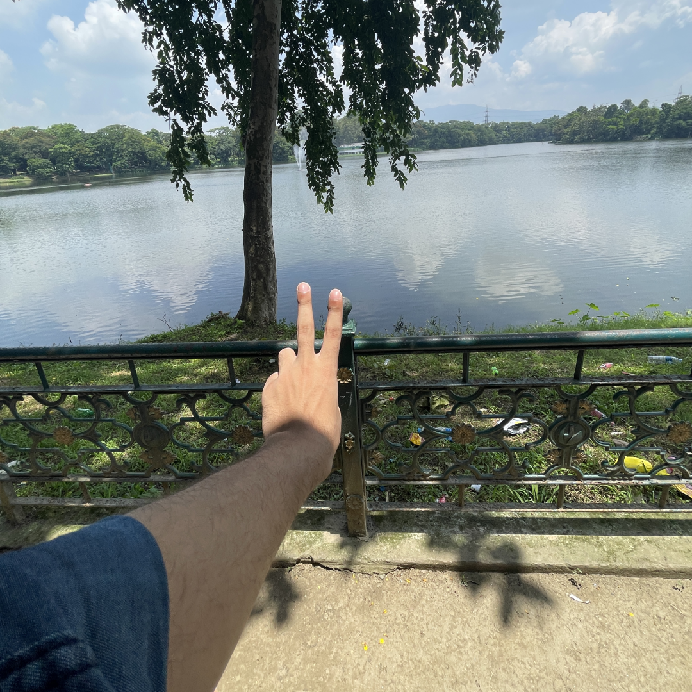

<h1  align="center">A big Hello from Madhurya ☺️    </h1>

   
  

<h3 align="center"> I'm a passionate front end developer from India 🇮🇳 with big dreams and a strong believer of </h3>

<h4> “Your time is limited, so don’t waste it living someone else’s life.”</h4>
&
  <h4>“Don’t let the noise of others’ opinions drown out your own inner voice.”</h4>

  

  

- 🌱 I’m currently learning **full stack dev, ML, Js**

- 📫  <a href="haitmadhurya@gmail.com"> Email ME  </a>

- ⚡ Fun fact **I'm a coder at daylight and a singer and music producer at moonlight!!**

 <h3 align="left">Connect with me:</h3>

<h3 align ="centre">
  About me
</h3>

  This is Madhurya Hait 👋🏻 19 years old ambitious coder and developer based in India. I'm currently a University 👨🏻‍🎓 student learning AI and Data Scienece. I'm ready to work on any web or app developement or any AI related projects.📗 

<h3 align="left">Languages and Tools:</h3>

              

  
 

 
 <h2> Check my repos for projects.</h2>
   
  Nice meeting you :)

  
  

